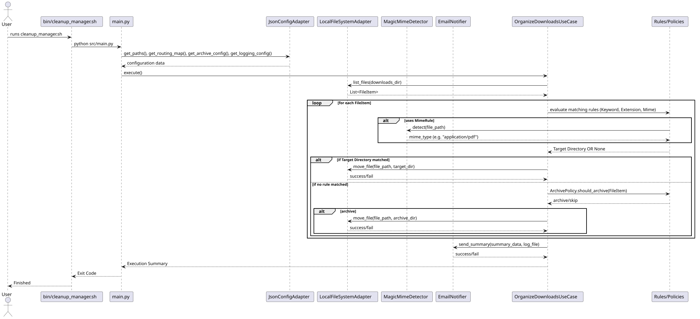

# The Application Layer

The Application Layer is responsible for orchestration. It defines the Use Cases (the "features" of our application) and coordinates the flow of data between the Domain, the external configurations, the file system, and the notification engine.

## Use Cases (`src/application/use_cases.py`)

### `OrganizeDownloadsUseCase`
This is the primary pipeline of the application. It takes the injected dependencies (FileSystem, Configuration, Notifier, MimeDetector) and executes the cleanup process.

**Execution Flow:**

1. Loads the configuration (Paths, Rules, Policies).
2. Uses the `IFileSystem` port to scan the target downloads directory, mapping raw file paths to `FileItem` domain models.
3. For each `FileItem`:
   - Iterates through the registered `Rules` (Keywords -> Extensions -> MIME).
   - If a rule matches, it executes the move via `IFileSystem` and records the `Action`.
   - If no rules match, it passes the file to the `ArchivePolicy`.
   - If the policy allows archiving, it moves the file to the calculated archive directory.
4. Generates a summary of all recorded `Action`s.
5. Invokes the `INotifier` port to dispatch an email summary to the user.

## Application Interfaces (Ports) (`src/application/interfaces.py`)

Like the Domain layer, the Application layer uses interfaces (ports) to communicate with external systems. This enforces the Dependency Inversion Principle, ensuring the Use Case remains highly testable and loosely coupled to any specific technology (e.g., it shouldn't care if I use local disks, AWS S3, or Google Drive).

### `IFileSystem`
Abstracts file operations.

- `list_files(directory: str)` -> `List[FileItem]`
- `move_file(source: str, destination_dir: str, filename: str)` -> `str`
- `get_archive_folders(archive_base: str)` -> `List[str]`
- `delete_directory(path: str)`
- `ensure_directory(path: str)`

### `IConfigProvider`

Abstracts configuration retrieval.
- `get_paths()`
- `get_rules()` -> `List[Rule]`
- `get_archive_policy()` -> `ArchivePolicy`
- `get_logging_config()`
- `get_notifications_config()`

### `INotifier`
Abstracts the alerting mechanism.

- `send_summary(summary_data, log_file)`

---
[Previous: Domain Layer](01_domain.md) | [Home](index.md) | [Next: Infrastructure Layer](03_infrastructure.md)
