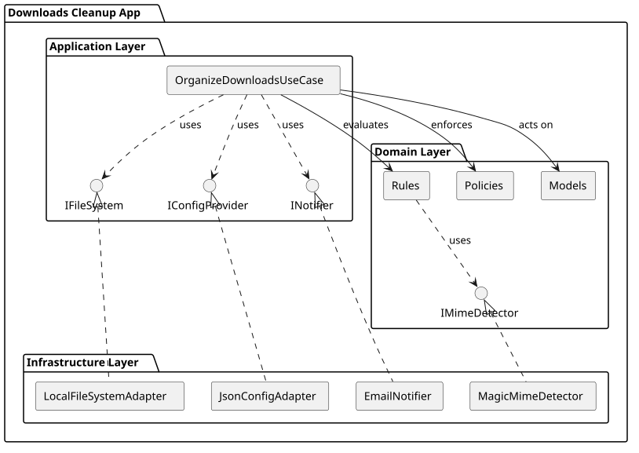

# Downloads Cleanup Manager

A robust, configurable Python utility built with Domain-Driven Design (DDD) to automatically organize and archive your cluttered downloads directory.

## Table of Contents
1. [Overview](#overview)
2. [High-Level Architecture](#high-level-architecture)
3. [Setup & Installation](#setup--installation)
4. [Usage](#usage)
5. [Detailed Documentation](#detailed-documentation)

## Overview

The **Downloads Cleanup Manager** uses simple, declarative rules to organize cluttered directories.

### The Flow
The program operates as follows:

1. The **Cleanup Manager** retrieves a list of **File Items** from the designated Downloads directory.
2. For each **File Item**, the manager evaluates a series of **Routing Rules** (which check the file's *keyword*, *extension*, or *MIME type*).
3. If a **Rule** successfully matches the file, the manager executes a **Move Action**, relocating the file to the Rule's target destination.
4. If a file does not match any **Routing Rules**, it is evaluated by the **Archive Policy**. If the file is older than the maximum allowed age and is not exceptionally large, the policy authorizes an **Archive Action**, moving the file to a long-term storage directory organized by date.
5. If the file is too new or too large to be archived, it is skipped and remains in the Downloads directory.
6. After all files are processed, the manager dispatches a **Summary Notification** detailing every action performed.

## High-Level Architecture

The project is structured according to strict Domain-Driven Design (DDD) principles employing layered architecture:

- **Domain Layer**: Contains business entities (Files, Actions), routing rules, and archiving policies.
- **Application Layer**: Contains the orchestration (Use Cases) and interfaces for external dependencies.
- **Infrastructure Layer**: Contains concrete implementations for file systems, config parsing, MIME detection, and email notifications.



## Setup & Installation

The project uses `conda` for environment and dependency management.

1. **Clone the repository** (if you haven't already).
2. **Create the conda environment**:
   ```bash
   conda env create -f environment.yml
   ```
3. **Configure the application**:
   - Copy or edit `config/config.json`.
   - Update your `paths`, `routing` maps, and `notifications` settings as required.
   - Example configuration documentation can be found in the [Configuration Docs](04_configuration.md).

## Usage

The application is executed via a wrapper script that automatically ensures the conda environment is active.

```bash
# Run a dry-run (preview changes without moving files)
./bin/cleanup_manager.sh --dry-run

# Run the actual cleanup
./bin/cleanup_manager.sh
```

## Detailed Documentation

To understand the system design or to extend its functionality, please review the detailed documentation for each architectural layer:

1. [The Domain Layer (`01_domain.md`)](01_domain.md) - Core models, rules, and business logic.
2. [The Application Layer (`02_application.md`)](02_application.md) - Orchestration, use cases, and system sequence.
3. [The Infrastructure Layer (`03_infrastructure.md`)](03_infrastructure.md) - Concrete adapters and implementation details.
4. [Configuration Reference (`04_configuration.md`)](04_configuration.md) - Guide for `config.json`.

## Viewing the Documentation Locally

This project uses **MkDocs** with the Material theme for beautifully rendered documentation. To view it locally as a webpage:

1. Ensure your conda environment is activated:
   ```bash
   conda activate downloads_cleanup
   ```
2. Start the local development server:
   ```bash
   mkdocs serve
   ```
3. Open your browser and navigate to: `http://127.0.0.1:8000/`
